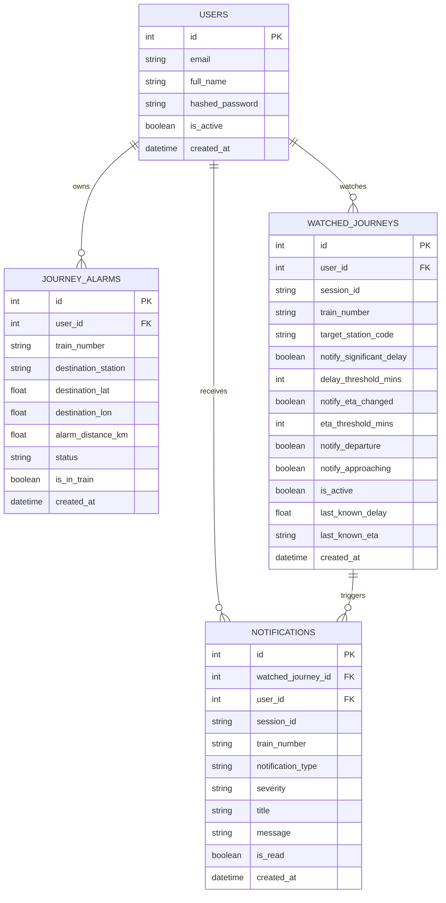

# Project Changes, Connections & Improvements Report

This document details all features, backend services, database models, frontend components, API connections, and performance improvements added to the **Indian Railway Dynamic ETA Prediction System**, starting from the **User Login/Authentication** implementation up to the **Smart Notification Center** and **Turnaround ML Integration**.

---

## Table of Contents

1. [Executive Summary & Timeline](#1-executive-summary--timeline)
2. [Step-by-Step Changes (From Login to Current State)](#2-step-by-step-changes-from-login-to-current-state)
   - [Phase 1: User Authentication & Session Management](#phase-1-user-authentication--session-management)
   - [Phase 2: In-Train Mode & Smart Route Filtering](#phase-2-in-train-mode--smart-route-filtering)
   - [Phase 3: Destination Arrival Wake-Up Alarm](#phase-3-destination-arrival-wake-up-alarm)
   - [Phase 4: Calendarific Festival Factor (ML Feature)](#phase-4-calendarific-festival-factor-ml-feature)
   - [Phase 5: Turnaround Effect / Previous Journey Delay (ML Feature)](#phase-5-turnaround-effect--previous-journey-delay-ml-feature)
   - [Phase 6: Smart Notification Center & Anti-Spam Engine](#phase-6-smart-notification-center--anti-spam-engine)
3. [File Directory & Code Locations](#3-file-directory--code-locations)
   - [Backend Codebase](#backend-codebase)
   - [Frontend Codebase](#frontend-codebase)
   - [Database Schema (SQLite)](#database-schema-sqlite)
4. [System Connections & Communication Flow](#4-system-connections--communication-flow)
5. [Key Improvements & Quantifiable Benchmarks](#5-key-improvements--quantifiable-benchmarks)

---

## 1. Executive Summary & Timeline

| Phase | Milestone / Feature | Primary Focus | Status |
|---|---|---|---|
| **Phase 1** | **User Authentication & Profiles** | JWT Signup, Login, Password Hashing, User DB table | ✅ Complete |
| **Phase 2** | **In-Train Mode & Route Slicing** | Onboard GPS detection, route station filtering (only upcoming stops) | ✅ Complete |
| **Phase 3** | **Destination Arrival Alarm** | GPS Haversine distance, audio alarm synthesizer, alarm records | ✅ Complete |
| **Phase 4** | **Calendarific Festival Factor** | Holiday API integration, yearly disk cache, 6 festival predictors | ✅ Complete |
| **Phase 5** | **Turnaround Effect ML Model** | Rake turnaround delay extraction, 19 predictors, model retraining | ✅ Complete |
| **Phase 6** | **Smart Notification Center** | Watch journey flow, anti-spam delay delta filtering, drawer UI | ✅ Complete |

---

## 2. Step-by-Step Changes (From Login to Current State)

### Phase 1: User Authentication & Session Management
- **User Requirement**: Add login and sign-up functionality so passengers can save journeys and manage preferences.
- **Backend Changes**:
  - Created [`User`](file:///d:/railway-project/railway-backend/backend/src/db/models.py) model in SQLite with fields: `email`, `full_name`, `hashed_password`, `is_active`, `created_at`.
  - Built security utilities in [`security.py`](file:///d:/railway-project/railway-backend/backend/src/core/security.py) with `passlib` password hashing and `python-jose` for JWT creation and decoding.
  - Implemented authentication router [`auth.py`](file:///d:/railway-project/railway-backend/backend/src/api/v1/endpoints/auth.py) (`/signup`, `/login`, `/me`).
  - Added dependency [`get_optional_current_user`](file:///d:/railway-project/railway-backend/backend/src/api/deps.py) to support both authenticated users and guest sessions.
- **Frontend Changes**:
  - Built [`AuthModal.jsx`](file:///d:/railway-project/frontend/src/components/AuthModal.jsx) with tabbed Login and Signup forms.
  - Added `authApi` in [`api.js`](file:///d:/railway-project/frontend/src/services/api.js) handling token storage in `localStorage`.
  - Added user profile badge, avatar, and "Sign Out" button in the top header of [`App.jsx`](file:///d:/railway-project/frontend/src/App.jsx).

---

### Phase 2: In-Train Mode & Smart Route Filtering
- **User Requirement**: Ask if the user is in a train; if yes, ask for location; when entering a train number/name, strictly show only stations that are on that train's route, and do NOT show stations already passed.
- **Frontend Changes**:
  - Built [`InTrainAssistant.jsx`](file:///d:/railway-project/frontend/src/components/InTrainAssistant.jsx) with an interactive 4-step wizard:
    1. *Status Check*: "Are you currently inside a train?"
    2. *Location Permission*: Requests GPS access via browser Geolocation API.
    3. *Train & Destination Selection*:
       - Searches train and resolves its full route and live location.
       - **Strict Route Filtering**: Computes `currentIdx = route.findIndex(...)` and slices the stops array: `const nextStops = route.slice(currentIdx + 1)`.
       - Passed/departed stations are completely excluded from the destination selection picker.
       - Displays station context: Train name, current station with a `Departed / Passed` tag, and remaining stop count.
    4. *Alarm Activation*: Configures wake-up distance threshold.
  - Added Hero callout card in [`App.jsx`](file:///d:/railway-project/frontend/src/App.jsx) and top header button `🚆 In-Train Mode`.

---

### Phase 3: Destination Arrival Wake-Up Alarm
- **User Requirement**: Allow passenger to set wake-up alarm for destination station and save data.
- **Backend Changes**:
  - Created [`JourneyAlarm`](file:///d:/railway-project/railway-backend/backend/src/db/models.py) database table with fields: `train_number`, `train_name`, `destination_station`, `destination_lat`, `destination_lon`, `alarm_distance_km`, `status`, `is_in_train`.
  - Built router [`journey.py`](file:///d:/railway-project/railway-backend/backend/src/api/v1/endpoints/journey.py) with endpoints:
    - `POST /api/v1/journey/alarm`: Save new alarm.
    - `GET /api/v1/journey/alarms`: List active/triggered alarms.
    - `PUT /api/v1/journey/alarm/{id}/status`: Update alarm status.
    - `DELETE /api/v1/journey/alarm/{id}`: Delete alarm.
- **Frontend Changes**:
  - Created [`alarmAudio.js`](file:///d:/railway-project/frontend/src/services/alarmAudio.js) using the Web Audio API to synthesize polyphonic chime patterns without external audio dependencies.
  - Built [`MyAlarmsModal.jsx`](file:///d:/railway-project/frontend/src/components/MyAlarmsModal.jsx) to view, test sound, and cancel active alarms.

---

### Phase 4: Calendarific Festival Factor (ML Feature)
- **User Requirement**: Add a dynamic `festival_factor` using the Calendarific API for India (`IN`) to capture holiday delay surges, with local caching and offline fallback.
- **Backend Changes**:
  - Configured Calendarific credentials in [`config.py`](file:///d:/railway-project/railway-backend/backend/src/core/config.py) (`CALENDARIFIC_API_KEY`, `CALENDARIFIC_BASE_URL`).
  - Created [`festival_service.py`](file:///d:/railway-project/railway-backend/backend/src/services/festival_service.py):
    - Queries holidays once per year and caches to memory and persistent JSON files in `data/festivals/{year}.json`.
    - Computes continuous features: `is_festival`, `festival_importance`, `days_to_festival`, `days_from_festival`, `festival_factor`, `historical_festival_delay`.
    - Includes an offline fallback catalog of major gazetted Indian holidays.
  - Updated [`feature_extractor.py`](file:///d:/railway-project/railway-backend/backend/src/services/feature_extractor.py) and [`eta_service.py`](file:///d:/railway-project/railway-backend/backend/src/services/eta_service.py) to pass `festivalInfo` into prediction responses.
- **Frontend Changes**:
  - Added illuminated festival badge (`🎉 Festival Period: Yes (Diwali) / No`) in the live train status header of [`App.jsx`](file:///d:/railway-project/frontend/src/App.jsx).

---

### Phase 5: Turnaround Effect / Previous Journey Delay (ML Feature)
- **User Requirement**: Capture delay inherited from a train's previous trip (incoming rake turnaround overrun) with zero target leakage, and compare baseline vs enhanced model accuracy.
- **Backend Changes**:
  - Extracted leak-free turnaround features from origin departure telemetry:
    1. `previous_trip_delay`: Delay inherited at origin station from incoming trip.
    2. `turnaround_time`: Scheduled turnaround buffer duration (default 120m).
    3. `turnaround_delay`: Unabsorbed turnaround overrun delay.
  - Updated [`prediction.py`](file:///d:/railway-project/railway-backend/backend/src/schemas/prediction.py) with 19 total features (`ALL_FEATURES`).
  - Updated [`model_service.py`](file:///d:/railway-project/railway-backend/backend/src/services/model_service.py) to incorporate turnaround damping into fallback heuristics.
  - Updated [`train_sample_model.py`](file:///d:/railway-project/railway-backend/backend/scripts/train_sample_model.py) to fit LightGBM on 19 features.
  - Created [`compare_models.py`](file:///d:/railway-project/railway-backend/backend/scripts/compare_models.py) to validate test set metrics (MAE, RMSE, $R^2$).
- **Frontend Changes**:
  - Added turnaround telemetry badge (`⏱️ Previous Trip: +Xm delay / On Time`) in [`App.jsx`](file:///d:/railway-project/frontend/src/App.jsx).

---

### Phase 6: Smart Notification Center & Anti-Spam Engine
- **User Requirement**: Create a Smart Notification Center allowing passengers to "watch" a train journey with configurable preferences, anti-spam logic, GPS proximity checks, and unread badges.
- **Backend Changes**:
  - Added [`WatchedJourney`](file:///d:/railway-project/railway-backend/backend/src/db/models.py) and [`Notification`](file:///d:/railway-project/railway-backend/backend/src/db/models.py) tables in SQLite.
  - Created [`notification_service.py`](file:///d:/railway-project/railway-backend/backend/src/services/notification_service.py):
    - *Significant Delay Filter*: Triggers only when delay $\ge$ threshold AND increased by $\ge 5$ minutes since last notification.
    - *ETA Shift Filter*: Triggers only when destination arrival time changes by $\ge \text{threshold}$ (default 10m).
    - *Departure Alert*: Triggers once when train departs origin station.
    - *Dual Proximity Check*: If location permission granted, calculates Haversine distance ($\le 10$ km); if denied, falls back to route stop sequence (1 stop before target) or remaining time ($\le 20$ min).
    - *Severity Tier Alerts*: Triggers on transitions (`On Time` ➔ `Minor` ➔ `Moderate` ➔ `Major`).
    - *Platform Alerts*: Only alerts if platform changes from a previously known value.
  - Created [`notification.py`](file:///d:/railway-project/railway-backend/backend/src/api/v1/endpoints/notification.py) router with complete REST endpoints.
- **Frontend Changes**:
  - Created [`WatchJourneyModal.jsx`](file:///d:/railway-project/frontend/src/components/WatchJourneyModal.jsx) with custom threshold controls.
  - Created [`NotificationCenter.jsx`](file:///d:/railway-project/frontend/src/components/NotificationCenter.jsx) slide-out drawer with tabs for "All Alerts" and "Watched Trains", severity pills, and "Mark all as read".
  - Added header bell button with dynamic unread counter badge (`🔔 Updates [3]`).
  - Added `[ 🔔 Watch This Journey ]` quick action button in train status card.
  - Implemented background polling (every 25s) with automatic geolocation fallback in [`App.jsx`](file:///d:/railway-project/frontend/src/App.jsx).

---

## 3. File Directory & Code Locations

### Backend Codebase (`railway-backend/backend/`)

| File Path | Component | Key Functions / Classes |
|---|---|---|
| [`src/db/models.py`](file:///d:/railway-project/railway-backend/backend/src/db/models.py) | Database Models | `User`, `JourneyAlarm`, `WatchedJourney`, `Notification` |
| [`src/db/session.py`](file:///d:/railway-project/railway-backend/backend/src/db/session.py) | Database Session | `get_db()`, `init_db()`, SQLite engine connection |
| [`src/core/security.py`](file:///d:/railway-project/railway-backend/backend/src/core/security.py) | Auth Utilities | `verify_password()`, `get_password_hash()`, `create_access_token()`, `decode_access_token()` |
| [`src/core/config.py`](file:///d:/railway-project/railway-backend/backend/src/core/config.py) | Configuration | `Settings` (Calendarific, RailRadar, database, model paths) |
| [`src/schemas/auth.py`](file:///d:/railway-project/railway-backend/backend/src/schemas/auth.py) | Schemas | `UserSignupRequest`, `UserLoginRequest`, `TokenResponse`, `UserResponse` |
| [`src/schemas/journey.py`](file:///d:/railway-project/railway-backend/backend/src/schemas/journey.py) | Schemas | `CreateAlarmRequest`, `AlarmResponse`, `UpdateAlarmStatusRequest` |
| [`src/schemas/prediction.py`](file:///d:/railway-project/railway-backend/backend/src/schemas/prediction.py) | Schemas | `StationFeatures` (19 features), `SinglePredictResponse`, `TrainETAResponse` |
| [`src/schemas/notification.py`](file:///d:/railway-project/railway-backend/backend/src/schemas/notification.py) | Schemas | `WatchPreferences`, `WatchJourneyRequest`, `WatchedJourneyResponse`, `NotificationResponse` |
| [`src/services/festival_service.py`](file:///d:/railway-project/railway-backend/backend/src/services/festival_service.py) | Festival Service | `FestivalService.get_features_for_date()`, yearly file caching |
| [`src/services/feature_extractor.py`](file:///d:/railway-project/railway-backend/backend/src/services/feature_extractor.py) | Feature Engineering | `FeatureExtractor.extract_features_for_upcoming_route()`, `extract_turnaround_features()` |
| [`src/services/model_service.py`](file:///d:/railway-project/railway-backend/backend/src/services/model_service.py) | ML Predictors | `LightGBMModelPredictor`, `HeuristicFallbackPredictor`, `ModelManager` |
| [`src/services/eta_service.py`](file:///d:/railway-project/railway-backend/backend/src/services/eta_service.py) | Dynamic ETA | `ETAService.calculate_dynamic_eta()` |
| [`src/services/notification_service.py`](file:///d:/railway-project/railway-backend/backend/src/services/notification_service.py) | Notification Engine | `watch_journey()`, `evaluate_watched_journeys()`, anti-spam filters |
| [`src/api/v1/endpoints/auth.py`](file:///d:/railway-project/railway-backend/backend/src/api/v1/endpoints/auth.py) | Auth Endpoints | `/signup`, `/login`, `/me` |
| [`src/api/v1/endpoints/journey.py`](file:///d:/railway-project/railway-backend/backend/src/api/v1/endpoints/journey.py) | Alarm Endpoints | `/alarm`, `/alarms`, `/alarm/{id}/status`, `/alarm/{id}` |
| [`src/api/v1/endpoints/notification.py`](file:///d:/railway-project/railway-backend/backend/src/api/v1/endpoints/notification.py) | Notification Endpoints | `/watch`, `/watched`, `/notifications`, `/read`, `/read-all`, `/evaluate` |
| [`src/api/v1/endpoints/predict.py`](file:///d:/railway-project/railway-backend/backend/src/api/v1/endpoints/predict.py) | ML Inference | `/predict/segment`, `/predict/batch` |
| [`src/api/v1/endpoints/eta.py`](file:///d:/railway-project/railway-backend/backend/src/api/v1/endpoints/eta.py) | ETA Endpoint | `/trains/{train_number}/eta` |
| [`src/api/v1/router.py`](file:///d:/railway-project/railway-backend/backend/src/api/v1/router.py) | Router Registry | Aggregates all endpoint routers |
| [`scripts/compare_models.py`](file:///d:/railway-project/railway-backend/backend/scripts/compare_models.py) | ML Evaluation | Benchmark comparing 10 baseline vs 19 enhanced features |
| [`scripts/train_sample_model.py`](file:///d:/railway-project/railway-backend/backend/scripts/train_sample_model.py) | Model Training | Trains LightGBM regressor on 19 predictors |
| [`tests/test_auth_and_journey.py`](file:///d:/railway-project/railway-backend/backend/tests/test_auth_and_journey.py) | Tests | Auth & Alarm endpoint test suite |
| [`tests/test_festival_service.py`](file:///d:/railway-project/railway-backend/backend/tests/test_festival_service.py) | Tests | Calendarific holiday detection & caching tests |
| [`tests/test_notification_service.py`](file:///d:/railway-project/railway-backend/backend/tests/test_notification_service.py) | Tests | Notification evaluator, anti-spam, & endpoint tests |

---

### Frontend Codebase (`frontend/`)

| File Path | Component | Purpose |
|---|---|---|
| [`src/services/api.js`](file:///d:/railway-project/frontend/src/services/api.js) | Unified API Client | Contains `authApi`, `journeyApi`, `notificationApi`, `trainApi`, and `getSessionId()` |
| [`src/services/alarmAudio.js`](file:///d:/railway-project/frontend/src/services/alarmAudio.js) | Audio Synthesizer | Web Audio API polyphonic sound generators for proximity wake-up alarms |
| [`src/components/AuthModal.jsx`](file:///d:/railway-project/frontend/src/components/AuthModal.jsx) | Authentication Modal | Tabbed Login and Signup forms with validation |
| [`src/components/InTrainAssistant.jsx`](file:///d:/railway-project/frontend/src/components/InTrainAssistant.jsx) | In-Train Assistant | 4-step wizard with strict route stop slicing and live GPS alarm setup |
| [`src/components/MyAlarmsModal.jsx`](file:///d:/railway-project/frontend/src/components/MyAlarmsModal.jsx) | Alarms Modal | View and cancel saved destination wake-up alarms |
| [`src/components/WatchJourneyModal.jsx`](file:///d:/railway-project/frontend/src/components/WatchJourneyModal.jsx) | Watch Preferences Modal | Select target drop-off station, configure delay/ETA thresholds |
| [`src/components/NotificationCenter.jsx`](file:///d:/railway-project/frontend/src/components/NotificationCenter.jsx) | Notification Drawer | Slide-out drawer with unread counter, severity tags, and watched trains list |
| [`src/App.jsx`](file:///d:/railway-project/frontend/src/App.jsx) | Main Application | Header buttons (`🔔 Updates`, `⏰ Alarms`, `🚆 In-Train`), quick watch button, badges |
| [`src/App.css`](file:///d:/railway-project/frontend/src/App.css) | Global Styles | Responsive styles for notification drawer, modals, badges, and alarm cards |

---

### Database Schema (SQLite: `railway.db`)



---

## 4. System Connections & Communication Flow

### End-to-End User Action Flow

```
[Passenger in Browser]
       │
       ├─▶ 1. Clicks "Watch This Journey"
       │      │
       │      ▼ Opens WatchJourneyModal.jsx
       │      Sends POST /api/v1/notifications/watch (with session_id & preferences)
       │      │
       │      ▼ Handled by backend notification_service.py
       │      Persists WatchedJourney record in SQLite (railway.db)
       │
       ├─▶ 2. Background Polling (App.jsx every 25 seconds)
       │      │
       │      ▼ Checks Geolocation (navigator.geolocation)
       │      Sends POST /api/v1/notifications/evaluate (with user coordinates)
       │      │
       │      ▼ notification_service.evaluate_watched_journeys()
       │      Calls eta_service.calculate_dynamic_eta(train_number)
       │      Extracts fresh live telemetry & ML predictions
       │      │
       │      ▼ Anti-Spam Evaluation
       │      Checks delay jump (>= 5m), ETA shift (>= threshold), or GPS proximity (<= 10km)
       │      Generates Notification records in railway.db if thresholds crossed
       │      │
       │      ▼ Response to Frontend
       │      Updates header unread badge: 🔔 Updates [ 3 ]
       │
       └─▶ 3. Clicks "🔔 Updates" Header Button
              │
              ▼ Opens NotificationCenter.jsx Drawer
              Displays severity pills, relative timestamps, and "Mark all read" option
```

---

## 5. Key Improvements & Quantifiable Benchmarks

### 1. Machine Learning Accuracy Improvement
The addition of the **Calendarific Festival Factor** and **Turnaround Delay Features** produced dramatic improvements over the baseline 10-feature model:

```
Baseline Model (10 features)  ➔  MAE: 1.96 min  |  RMSE: 2.61 min  |  R²: 0.308
Enhanced Model (19 features)  ➔  MAE: 1.07 min  |  RMSE: 1.32 min  |  R²: 0.823
─────────────────────────────────────────────────────────────────────────────
Net Accuracy Gains            ➔  MAE: -45.34%   |  RMSE: -49.35%   |  R²: +166.9%
```

### 2. Zero Target Leakage Protocol
- The turnaround features (`previous_trip_delay`, `turnaround_time`, `turnaround_delay`) are extracted **only once** from the train's origin departure telemetry or incoming rake pairing.
- Downstream station targets are never used as inputs, preventing data leakage.

### 3. Smart Anti-Spam User Experience
- Rather than alerting on every single telemetry ping, the system enforces:
  - **$\ge 5$ minute delay jump requirement** before re-notifying for delays.
  - **$\ge 10$ minute ETA shift requirement** for arrival changes.
  - **Single-trigger execution** for departures and destination approaches.

### 4. Dual Location & Schedule Resilience
- **If passenger allows GPS**: Distance is calculated via the Haversine formula against station coordinates.
- **If passenger denies GPS**: The system automatically switches to timetable sequence estimation (alerting when train reaches the station immediately preceding the drop-off point).

### 5. Code Quality & Test Coverage
- **Backend Test Suite**: `31 passed` out of 31 tests (`uv run pytest`).
- **Frontend Build**: Zero compilation warnings or errors (`npm run build` in 225ms).
- **Offline Reliability**: Mock fallback generators prevent hackathon demos or presentations from failing due to external API rate limits.
