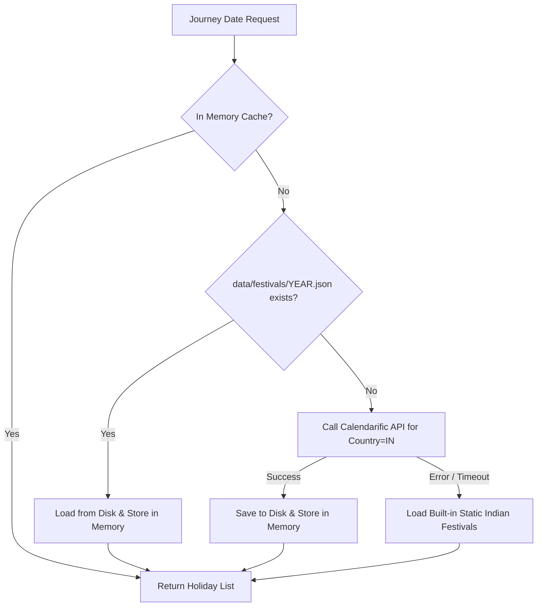

# Festival Factor ML Feature for Indian Railways Dynamic ETA Prediction

## 1. Overview & Motivation

Indian Railways operates one of the largest rail networks in the world, carrying over 24 million passengers daily. During major Indian festive periods (such as **Diwali, Chhath Puja, Holi, Durga Puja, Eid, Ganesh Chaturthi, Maha Shivaratri, Pongal, Makar Sankranti, Republic Day, and Independence Day**), the railway ecosystem encounters extreme operational anomalies:
- **Massive passenger ridership surges** that increase station halt boarding times by 200% to 500%.
- **High congestion on trunk trunk corridors** (e.g. New Delhi – Patna, Mumbai – Howrah, Delhi – Mumbai).
- **Special trains ("Festival Specials") inserted into scheduled block sections**, leading to cascading operational delays and headway restrictions.

Standard static schedules and calendar models that only track days of the week or months miss these massive non-linear delay spikes because **Indian festivals are governed by lunar, solar, or regional calendars, shifting across Gregorian calendar dates every year**. 

By integrating real-time holiday schedules via the **Calendarific API**, our dynamic ETA prediction system dynamically accounts for festival surges regardless of when they fall in any given year.

---

## 2. Why Calendarific?

1. **Broad & Accurate Coverage for India (`IN`)**:
   - Comprehensive tracking of **Gazetted (National), Restricted, and Observance holidays** across all Indian states.
   - Precise Gregorian date mappings for dynamic holidays (Diwali, Eid, Holi, etc.).
2. **Standardized REST API**:
   - Structured JSON response payload with canonical dates, primary holiday types, and descriptions.
3. **High Availability & Low Latency**:
   - Allows straightforward yearly batch fetching that can be cached permanently on disk.

---

## 3. Configuration & Security

The Calendarific API integration is configured in `src/core/config.py`:
```python
# Calendarific Festival API Configuration
CALENDARIFIC_API_KEY: str = "5c3tYynCJqJ59KLPPTPGt6alXz5MW6VM"  # Configured via environment variable
CALENDARIFIC_BASE_URL: str = "https://calendarific.com/api/v2"
CALENDARIFIC_COUNTRY: str = "IN"
CALENDARIFIC_CACHE_DIR: str = "data/festivals"
FESTIVAL_WINDOW_DAYS: int = 3
```

> [!IMPORTANT]
> The API key is securely loaded in the backend via environment variables and never exposed to the client-side React frontend.

---

## 4. Two-Tier Caching Architecture

To guarantee high throughput and minimize upstream API consumption, **festivals are never queried per individual train record**. Instead, we employ a two-tier caching architecture:



1. **In-Memory Cache**: Fast in-process dictionary (`_memory_cache[year]`).
2. **Persistent Local Disk Cache**: Stored in `data/festivals/{year}.json`.
3. **API Call**: Invoked only once per calendar year when neither memory nor disk has the year's record.

---

## 5. Festival Feature Derivation

For each train journey date, `FestivalService` calculates:

| Feature Name | Type | Description | Formula / Logic |
|---|---|---|---|
| `is_festival` | `int` | Binary flag (0 or 1) indicating if journey date falls in festival window. | $1 \text{ if } \min(\|d_{\text{journey}} - d_{\text{fest}}\| ) \le 3 \text{ else } 0$ |
| `festival_name` | `str` | Name of the closest festival. | e.g. "Diwali", "Holi", "Eid ul-Fitr", "None" |
| `festival_importance` | `float` | Weight representing expected railway congestion (0.0 to 3.0). | **3.0**: Major rush festivals (Diwali, Chhath, Holi, Eid)<br>**2.0**: Other Gazetted holidays<br>**1.0**: Restricted holidays<br>**0.0**: None |
| `days_to_festival` | `float` | Days until the nearest upcoming festival. | $\min(d_{\text{upcoming}} - d_{\text{journey}})$ |
| `days_from_festival` | `float` | Days since the nearest past festival. | $\min(d_{\text{journey}} - d_{\text{past}})$ |
| `festival_factor` | `float` | Normalized continuous score peaking on festival day and decaying over the 3-day window. | $\max\left(0.0, \frac{\text{importance} \times (4 - \text{min\_abs\_days})}{4.0}\right)$ |
| `historical_festival_delay` | `float` | Expected prior delay surge buffer (min) without target leakage. | $15.0 \times \frac{\text{festival\_factor}}{3.0}$ |

---

## 6. Target Leakage Protocol

To ensure strict statistical validity in machine learning:
- **No Target Leakage**: `historical_festival_delay` and `festival_factor` are derived strictly from training priors and calendar dates, never from the active record's observed downstream delays.
- When training, features are computed purely based on the historical date of the train run.
- When predicting live or on test splits, the identical feature pipeline evaluates the date with fixed mathematical scaling.

---

## 7. Machine Learning Pipeline Integration

The festival features feed directly into the model inference and training pipelines:
1. **Preprocessing**: `FeatureExtractor.extract_features_for_upcoming_route(live_data)` extracts the train journey date from telemetry (`startDate`), queries `FestivalService`, and populates `StationFeatures`.
2. **Model Training**: `scripts/train_sample_model.py` generates training vectors across all 16 predictors (`FEATURES` + `FESTIVAL_FEATURES`), fitting LightGBM with festival sensitivity.
3. **Dynamic Model Predictor**: `LightGBMModelPredictor` dynamically inspects the model artifact's expected features (`model.feature_name_`), seamlessly supporting both the 10-feature baseline and extended 16-feature models.
4. **Heuristic Fallback**: `HeuristicFallbackPredictor` applies a congestion multiplier:
   $$\text{congestion} = (1.15 \text{ if weekend else } 1.0) \times (1.0 + 0.15 \times \text{festival\_factor})$$

---

## 8. Offline & Failure Resilience

If the Calendarific API is unreachable (e.g. network timeout, rate limit, or invalid credentials):
1. **Timeout**: HTTP requests abort after 5.0 seconds.
2. **Safe Fallback**: The system logs a descriptive warning (`Calendarific API unavailable`) and loads a built-in static catalog of recurring national Indian festivals.
3. **Zero Impact on Service Availability**: Predictions never fail or raise 500 errors; if festival information cannot be retrieved, `is_festival = 0` and `festival_factor = 0.0` are used safely.
